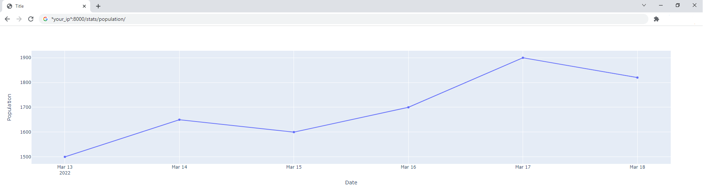

# it_evacuation_tg_bot

1. Create your bot through [Botfather](https://core.telegram.org/bots#6-botfather) and acquire bot token. **Don't forget to give bot the rights to read chat messages with ```/setprivacy```**.
2. Fill in .env. If you don't know your chat id, leave CHAT_ID field blank.
3. Run ```docker-compose up -d```
4. Add bot to your chat.
5. If you didn't fill in CHAT_ID in the first step:
   - Send ```/get_id``` command in your chat. Acquire your chat id.
   - Edit .env file and fill CHAT_ID field.
   - Run ```docker-compose down```
   - Run ```docker-compose up -d```

Chat members amount is requested each day. To look at plot, go to ```*your server ip*:8000/stats/population/```. It will look like this:



Db is backuped each week. Backups are stored in ```backups``` folder in your local project folder.
```logs``` folder will have telegram bot logs.
